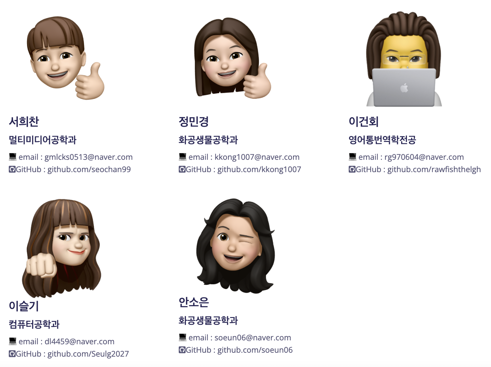

# 365cm

`2021 동국대 Farm 경진대회` 365commit의 공모작입니다.

[1. 소개](#Intro)  
[2. 설치 및 가동](#Install)  
[3. 팀원 소개](#Team)  

# Intro
### 🤝 프로젝트 배경
소아암환자는 늘고있지만 소아암환자를 위한 가발 제작협회나 기업등등은 줄어 소아암 환자를 위한 가발 용 모발 수급이 어려운 것을 발견했습니다.
이러한 상황에서 소아암 환자를 위한 모발 기부에 대해 사람들이 관심을 키우고, 모발을 기부할 수 있는지에 대한 자가 테스트와 함께 기부하는 글을 확인할 수 있는 웹 서비스 제작을 생각하게 되었습니다. 
### ⚙️ 개발환경 
* Framework : `Django 3.2.9`, `Rest Framework 3.12.4`
* Language : `Python3.9`
* OS : `MacOS`, `Window11`
* Database : `SQLite3`
* IDE : `VSCode`

# Install
1. 터미널에 아래 내용 입력

```
git clone https://github.com/Seulg2027/365cm.git
```

2. 가상환경 켜기

```
pipenv shell
```

3. Django 설치

```
pip install django
```

4. Django-allauth 설치

```
pip install django-allauth
```

5. Pillow 설치

```
pip install pillow
```

6. rest_framework 설치
```
pip install djangorestframework
```

7. 모델의 변경내용 DB 스키마에 적용하기 위해 마이그레이션 생성

```
python manage.py makemigrations
```

8. DB에 마이그레이션 적용

```
python manage.py migrate
```
9. 슈퍼유저 생성
```
python manage.py createsuperuser
```

10. 실행

```
python manage.py runserver
```

# Team
### 팀명 : 365commit
